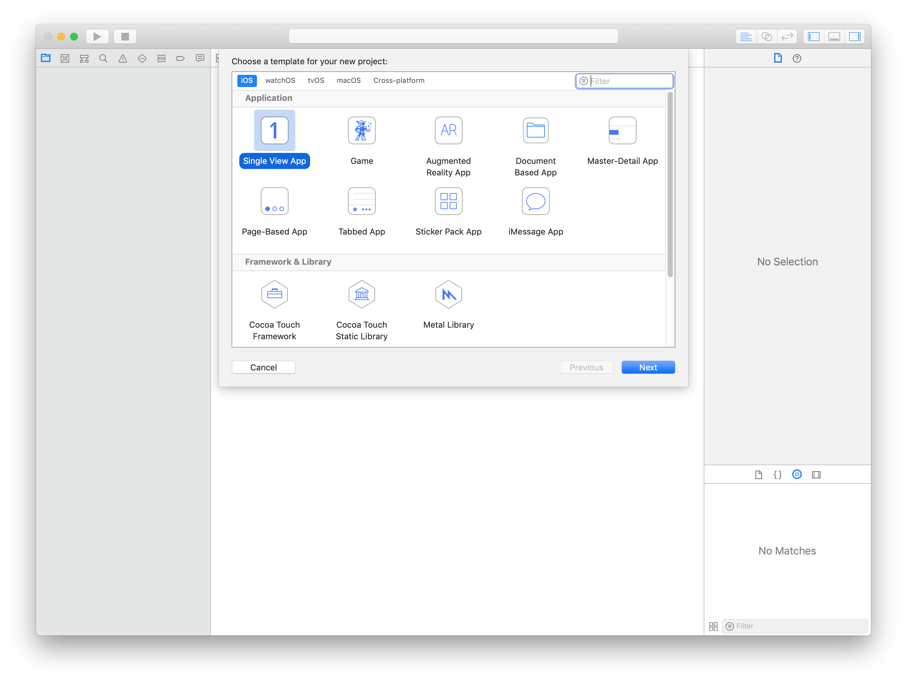
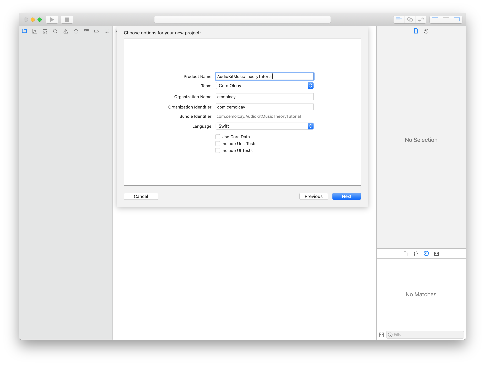
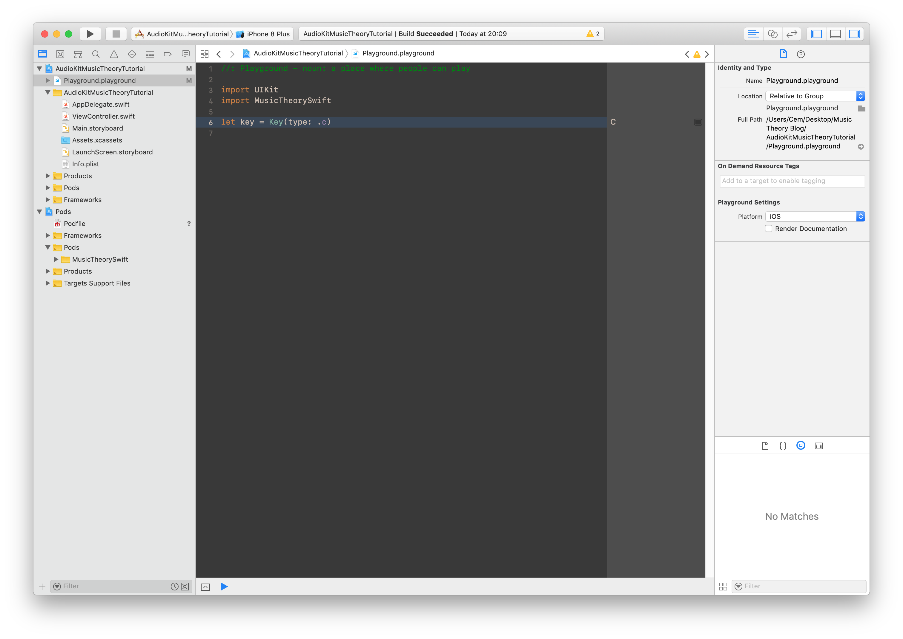

Always Play in Scale - A Music Theory Library for iOS in Swift
===

Table of Contents
---
- [Introduction](#intro)
- [A Little Back Story](#backstory)
- [MusicTheory Library](#music-theory)
- [Creating a Simple AudioKit Synth](#aksynth)
- [Preparing AKSequencer](#aksequencer)
- [The App](#app)

Introduction <a name="intro"></a>
---

In this tutorial, I'll cover my MusicTheory Swift library, with a case study app where AKSequencer drives a simple AudioKit Synth in a scale and rate we want. So, basically we will learn how to use MusicTheory, how to create a simple AudioKit synth, hooking it up with AKSequencer and using MusicTheory library in action.

A little back story <a name="backstory"></a>
---

I started to write this little library back in January 2017, after I quit my startup job in the Valley. As a guitar/keyboard player and iOS developer, I always wanted to work on a music app. So, with all my free time, I've get started on my iOS music app development journey where my two passions, creating music and developing apps merged. 

First thing first, I wanted to make computer play something. So, I needed music notes, a parser that convert musical notes to MIDI data and a synthesizer that generate sound from that MIDI data. It didn't too long for me to find AudioKit where you can create your synths easily with ready-to-use MIDI layer, AKMIDI, which saves you from CoreMIDI API. Since AudioKit take care of MIDI and Synth layers, all I need was a meaningful, easy-to-use music theory API just like AudioKit did with its Swift API. 

As a person who took his last music theory class like a decade ago, I started to learn music theory again, with a software-engineer point of view. When you deal with music notes, intervals, scales, chords, rhythmes, time-signatures etc, you actually deal with some set of numbers that produces a sound we call music. Lucy for us, people from 15th-16th century did this mathematical work perfectly. It's so perfect, it's almost like a specifiaction for music theory that you can implement it in any language you want. Which I did in Swift. So let's dive in.

MusicTheory Library <a name="music-theory"></a>
---

This is a universal library for iOS, iOS Extensions, macOS, tvOS and watchOS. You can use it with cocoapods by adding `pod 'MusicTheorySwift'` into your podfile.  

It has mainly `Key`, `Accidental`, `Pitch`, `Interval` data types that defines the building blocks of music. Also has `Scale` and `Chord` data types for making things as easy as possible. Lastly, `Tempo`, `TimeSignature` and `NoteValue` data types are great for making time related calculations for a sequencer or sampler implementation.

Let us prepare a Xcode Playground project and do some coding.  

- First, create a Single View iOS app 




- Then, create a Podfile and add `MusicTheorySwift` pod.

```
target 'AudioKitMusicTheoryTutorial' do
  use_frameworks!
  pod 'MusicTheorySwift'
end

post_install do |installer|

  installer.pods_project.build_configurations.each do |config|
    config.build_settings.delete('CODE_SIGNING_ALLOWED')
    config.build_settings.delete('CODE_SIGNING_REQUIRED')
  end

  installer.pods_project.targets.each do |target|
    target.build_configurations.each do |config|
      config.build_settings['CONFIGURATION_BUILD_DIR'] = '$PODS_CONFIGURATION_BUILD_DIR'
    end
  end
end
```

The last `post_install` part will help us on using pod module with playgrounds.
For more information visit [this github issue](https://github.com/ReactiveX/RxSwift/issues/1660).

- Nice, now make a `pod install` and open up the workspace CocoaPods created for us.
- Let's build our project with `⌘+B`.
- And add a iOS Playground file inside our project.
- Let's `import MusicTheorySwift` to our playground.


We are ready to roll now! Let's begin exploring the library.

* Let's create C♯-minor scale and print out it's pitches for octave 4.
* C-major scale has two main parts. 
* A `Key`, which is C in our case.
* And a ``


